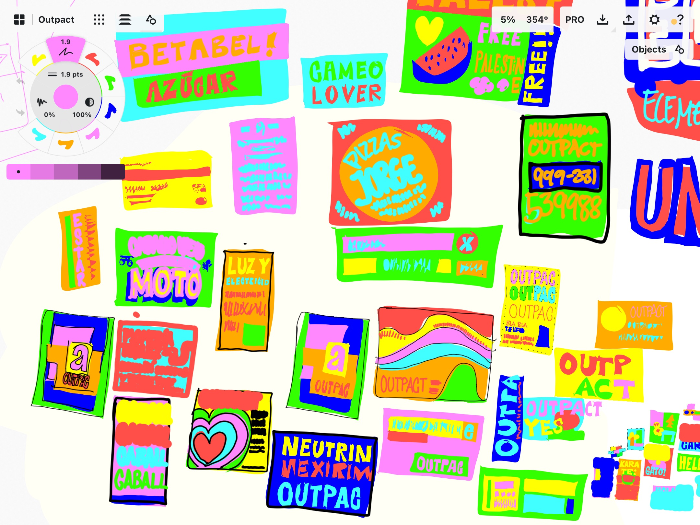

+++
date = '2025-09-07T21:51:32-06:00'
draft = false
title = 'First Post'
+++

So every blog thingie needs a first post.

This is mine.

It'll be short because it is late and also I'm running out of battery in this laptop.

But I didn't want to succumb to my adhd for a change, and I want this new website to have at least a tiny bit of content.

So: I'll drop some screenshots of [Outpact](https://tortilla.studio/fonts/outpact), the font I've been working on for most of this year, and I'm really proud. It's my first nice big widely useful font under my own name and I'll be giving it away for free.

So, without further rambling: here's some sketches for Outpact's upcoming release graphics.

{.pics}

{.pics}

They're inspired on mexican rótulos, flyers for repairpeople you get on the street, or find taped to your intercom.
{.caption}

{.pics}

{.pics}

{.pics}

Also on cumbia graphics, a bit. Specially [some texts](https://www.google.com/url?sa=t&source=web&rct=j&opi=89978449&url=https://www.youtube.com/watch%3Fv%3DUMhfulZu8r8&ved=2ahUKEwiF9P7josiPAxX14MkDHaX1O48QtwJ6BAgMEAI&usg=AOvVaw2AmuzuKxLVFEkBcypBp2xG) in these sketches lol.
{.caption}

{.pics}

{.pics}

{.pics}

{.pics}

*Anyway… that takes care of the first post I guess 🤷🏻‍♀️*

Take care. Keep coming back to this little blog of mine.